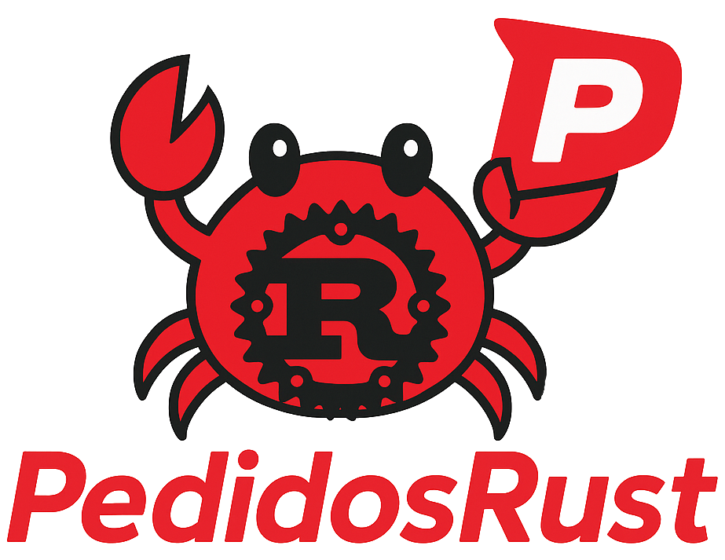
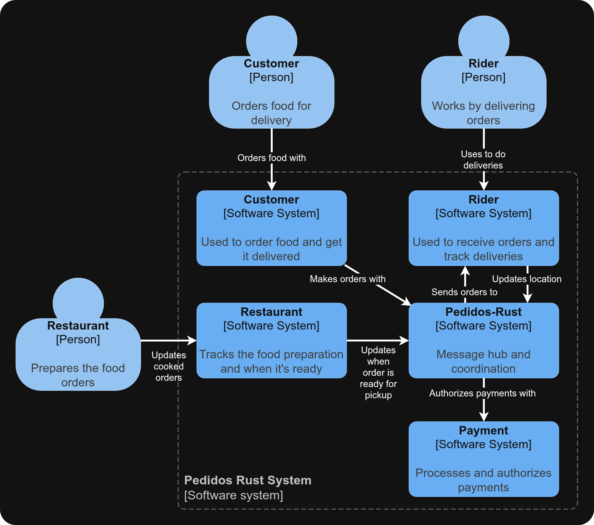
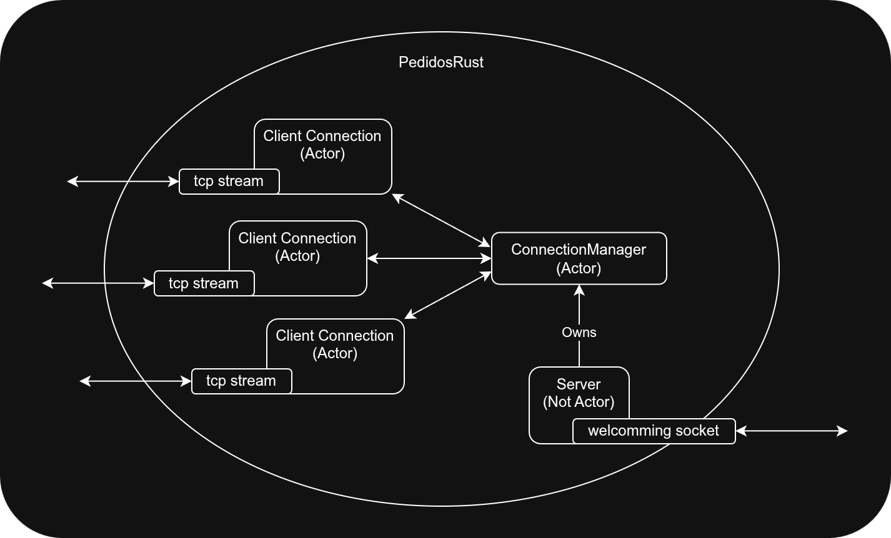
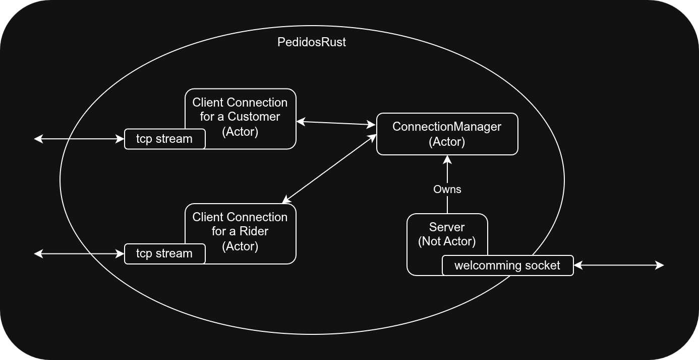
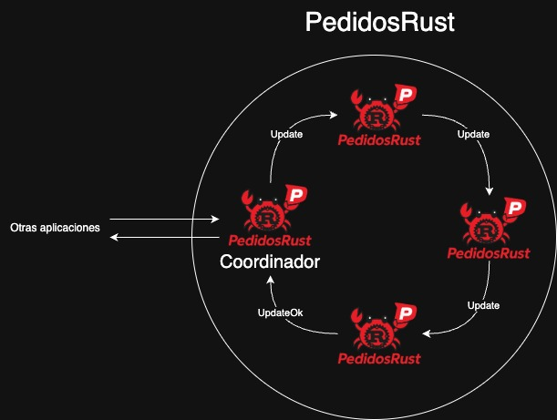

[](https://classroom.github.com/a/YmMajyCa)

Para información sobre setup del proyecto ver el documento [`./docs/contribute.md`](./docs/contribute.md).

---

# PedidosRust - Grupo MutexMasters

<p align="center">
    
</p>

PedidosRust es una nueva aplicación para conectar restaurantes, repartidores y comensales. Gracias a su innovadora implementación distribuida, permitirá reducir los costos y apuntar a ser líder en el mercado.

Los comensales podrán solicitar un pedido a un restaurante, los restaurantes notifican cuando el pedido está listo, y los repartidores buscan pedidos cercanos y los entregan.

### Integrantes

| Nombre                            | Padrón | Email              |
| --------------------              | ------ | -----------------  |
| Avalos, Victoria                  | 108434 | vavalos@fi.uba.ar  |
| Chacón, Ignacio                   | 108298 | ichacons@fi.uba.ar |
| Diem, Walter Gabriel              | 105618 | wdiem@fi.uba.ar    |
| Funes Cabanelas, Nicolás Ezequiel | 109830 | nfunes@fi.uba.ar   |

---

### Table of contents

1. [Aplicaciones](#Aplicaciones)
1. [Estructura del repositorio y sistema](#Estructura-del-repositorio-y-sistema)
1. [Uso](#Uso)
1. [Diseño](#Diseño)
   1. [Pedidos-rust](#Pedidos-rust)
   1. [Customer](#Customer)
   1. [Rider](#Rider)
   1. [Restaurant](#Restaurant)
   1. [Payment](#Payment)
1. [Mensajes](#Mensajes)
1. [Resiliencia distribuida](#Resiliencia-distribuida)

## Aplicaciones

Hay 5 aplicaciones ejecutables, las cuales son referenciados por sus nombres en inglés (por consistencia con la convención de programación):

- Requeridas por la consigna (4 apps): comensales (`customers`), restaurantes (`restaurants`), repartidores (`riders`), gateway de pagos (`payment`).

- Adicional (1 app): aplicación para simplificar el manejo de mensajes entre actores llamada `pedidos-rust`.

## Estructura del repositorio y sistema

El root del repositorio es un workspace que contiene los proyectos (ejecutables binarios separados, cada uno con su `Cargo.toml`) y el código en común:

```
.
├── common          Código compartido entre aplicaciones y protocolo
├── customer        Project del customer
├── docs
├── payment         Project del payment gateway
├── pedidos-rust    Project del pedidos-rust
├── restaurant      Project del restaurant
├── rider           Project del rider
└── Cargo.toml      Configuración del workspace
```

## Uso

Se deja las instrucciones para ejecutar las diversas apps:

**Customer:**

```bash
cargo run -p customer
```

**Payment:**

```bash
cargo run -p payment
```

**Pedidos-rust:**

```bash
cargo run -p pedidos-rust
```

**Restaurant:**

```bash
cargo run -p restaurant
```

**Rider:**

```bash
cargo run -p rider
```

---

## Diseño

### <ins>Application level</ins>

<p align="center">
    
</p>

### <ins>Pedidos-rust</ins>

#### Finalidad

Aplicación que es un servidor distribuido que recibe pedidos de los customers, autoriza los pagos con el payment gateway, coordina con los restaurantes la preparación del pedido y una vez listo le ofrece los pedidos a los riders para que realicen el delivery y le da la asignación final al que acepte primero, mantiene actualizado al customer del estado del pedido en todo momento y efectiviza el cobro del pedido una vez se confirma que el delivery fue entregado al customer.

#### Estado interno

La estructura de la app consta de una entidad `Server` que es dueña del welcomming socket de TCP (usado de manera asíncrona para recibir conexiones), por cada conexión recibida de tiene un actor `ClientConnection` y estos pueden solicitar funcionalidades que requieren visibilidad de todas las conexiones del actor `ConnectionManager`. Todo el modelado de actores apalanca los handlers asíncronos para la concurrencia.

<p align="center">
    
</p>

En una situación donde hay sólo 1 customer y 1 rider conectados al PedidosRust, los actores presentes serían:

<p align="center">
    
</p>

**Variables internas de `Server`:**

```rust
pub struct Server {
    logger: Logger,
    connection_manager: Addr<ConnectionManager>,
}
```

**Variables internas de `ClientConnection`:**

```rust
pub struct ClientConnection {
    pub tcp_sender: Addr<TcpSender>,
    pub logger: Logger,
    pub id: u32,
    pub connection_manager: Addr<ConnectionManager>,
    pub peer_location: Option<Location>,
}
```

**Variables internas de `ConnectionManager`:**

```rust
pub struct ConnectionManager {
    pub logger: Logger,
    pub riders: HashMap<RiderId, Addr<ClientConnection>>,
    pub customers: HashMap<CustomerId, CustomerData>,
    pub orders_in_process: HashMap<RiderId, CustomerId>,
    pub pending_delivery_requests: VecDeque<Message>,
}
```

### <ins>Customer</ins>

#### Finalidad

Aplicación que utiliza el customer para poder consultar los restaurantes donde puede hacer un pedido, elegir un restaurante para realizarle un pedido y recibir notificaciones (push notifications) de cómo progresa el pedido a medida que se avanza en el proceso de delivery.

Proceso de delivery:

1. Pago autorizado
1. Restaurante está preparando el pedido
1. Pedido está listo
1. Rider 1234 está llevando el pedido
1. Pedido entregado

#### Estado interno

Está modelado como un actor con handlers asíncronos para manejar la concurrencia. Utiliza TCP para la comunicación por la red.

**Variables internas de `Customer`:**

```rust
struct Customer {
    tcp_sender: Addr<TcpSender>,
    logger: Logger,
    location: Location,
}
```

### <ins>Rider</ins>

#### Finalidad

Aplicación que utiliza el rider para actualizar su ubicación al PedidosRust, recibir ofertas de deliveries (se le dice _oferta_ porque PedidosRust ofrece a los riders la posibilidad de realizar un delivery, el rider puede aceptar o no, y PedidosRust confirma si el rider fue elegido como el que efectivamente va a realizar el envío), ir a retirar el pedido del restaurante para llevarle al customer, y viajar hasta la ubicación del customer para realizar la entrega del pedido.

#### Estado interno

Está modelado como un actor con handlers asíncronos para manejar la concurrencia. Utiliza TCP para la comunicación por la red.

**Variables internas de `Rider`:**

```rust
struct Rider {
    tcp_sender: Addr<TcpSender>,
    logger: Logger,
    location: Location,
    customer_location: Option<Location>,
    busy: bool,
}
```

### <ins>Restaurant</ins>

#### Finalidad

Aplicación que utilizan los restaurantes para recibir pedidos de los comensales, notificar cuando los comienza a preparar y cuando el pedido está listo para ser retirado por el rider. El restaurante puede cancelar un pedido por falta de stock con una probabilidad aleatoria del 10% (simulando que el stock se agota en el momento de la preparación).

#### Estado interno

Está modelado con tareas asíncronas de tokio para manejar los pedidos concurrentemente, asignando cada pedido a una tarea asíncrona.
Se comunica con PedidosRust mediante TCP para recibir los pedidos y contestar.

**Variables internas de `Restaurant`:**

```rust
struct Payment {
    tcp_sender: Addr<TcpSender>,
    location: Location
}
```

### <ins>Payment</ins>

#### Finalidad

Aplicación que autoriza y efectiviza un cobro. El flujo de un pago consta de dos fases secuenciales: primero se autoriza el pago y luego se efectiviza el cobro. La primera fase (la autorización del pago) puede fallar debido a un rechazo. Pero la efectivización del mismo (debitar el dinero) se realiza sin posibilidad de falla.

Se entiende al payment gateway como un servicio externo de terceros, como podría ser Visa o MasterCard.

#### Estado interno

Está modelado con tareas asíncronas para manejar la concurrencia. Utiliza TCP para la comunicación por la red.

**Variables internas de `Payment`:**

```rust
struct Payment {
    tcp_sender: Addr<TcpSender>,
    logger: Logger,
}
```

## Mensajes

Se muestra a continuación un diagrama de secuencia que representa el flujo de mensajes entre las aplicaciones en un caso de uso exitoso donde un cliente realiza un pedido a un restaurante.

<p align="center">
    
</p>

Se presentan los mensajes que intercambian las aplicaciones para poder llevar a cabo el envío de pedidos de manera efectiva y resiliente:

| Mensaje                   | Emisor                 | Receptor               | Payload                                                              | Propósito                                                                                                           |
|---------------------------| ---------------------- | ---------------------- |----------------------------------------------------------------------|---------------------------------------------------------------------------------------------------------------------|
| Get Restaurants           | Customer👨🏻‍🦱             | PedidosRust🦀          | `customer_location: Location` (`Location` son dos enteros `x` e `y`) | Solicitar restaurantes para realizar un pedido                                                                      |
| Restaurants               | PedidosRust🦀          | Customer👨🏻‍🦱             | `data: String`                                                       | Comunicar los restaurantes disponibles                                                                              |
| Order                     | Customer👨🏻‍🦱             | PedidosRust🦀          | `restaurant: String, amount: f64`                                    | Realizar un pedido                                                                                                  |
| Push Notification         | PedidosRust🦀          | Customer👨🏻‍🦱             | `notification_msg: String`                                           | Envío de información para seguimiento en tiempo real del estado del pedido                                          |
| Location Update           | Rider🛵                | PedidosRust🦀          | `new_location: Location`                                             | Informar nueva ubicación                                                                                            |
| Delivery Offer            | PedidosRust🦀          | Rider🛵                | `customer_id: u32, customer_location: Location`                      | Ofrecer un pedido al rider que puede aceptar o no                                                                   |
| Delivery Offer Accepted   | Rider🛵                | PedidosRust🦀          | `customer_id: u32, customer_location: Location`                      | Aceptar el ofrecimiento de pedido                                                                                   |
| Delivery Offer Confirmed  | PedidosRust🦀          | Rider🛵                | `customer_id: u32, customer_location: Location`                      | Confirmar que el rider es el elegido para hacer el delivery                                                         |
| Picked Up From Restaurant | Rider🛵                | PedidosRust🦀          | `rider_id: u32`                                                      | Informar que el rider ya hizo el retiro de la orden del restaurante                                                 |
| Delivery Done             | Rider🛵                | PedidosRust🦀          | `rider_id: u32`                                                      | Informar que el rider llegó a la ubicación del customer y entregó el pedido                                         |
| Finish Delivery           | PedidosRust🦀          | Customer👨🏻‍🦱             |                                                                      | Realizar última actualización del pedido para marcar que se completó el mismo, y que el cliente pueda realizar otro |
| Authorize Payment         | PedidosRust🦀          | Payment 💲             | `customer_id: u32, amount: f64`                                      | Solicitar la autorización del pago                                                                                  |
| Payment Authorized        | Payment 💲             | PedidosRust🦀          | `customer_id: u32, amount: f64`                                      | Informar que el pago se autorizó exitosamente                                                                       |
| Payment Denied            | Payment 💲             | PedidosRust🦀          | `customer_id: u32, amount: f64`                                      | Informar que el pago no se pudo autorizar                                                                           |
| Execute Payment           | PedidosRust🦀          | Payment 💲             | `customer_id: u32, amount: f64`                                      | Debitar/efectivizar el pago                                                                                         |
| Payment Executed          | Payment 💲             | PedidosRust🦀          | `customer_id: u32, amount: f64`                                      | Informar que el débito del pago fue exitoso                                                                         |
 Order In Progress         | Restaurant🍴           | PedidosRust🦀          | `customer_id: u32`                                                   | Comenzar a preparar orden                                                                                           |
| Prepare Order             | PedidosRust🦀          | Restaurant🍴           | `customer_id: u32, price: u64`                                       | Preparar orden para un customer                                                                                     |
| Order In Progress         | Restaurant🍴           | PedidosRust🦀          | `customer_id: u32`                                                   | Comenzar a preparar orden                                                                                           |
| Inform Location           | Restaurant🍴           | PedidosRust🦀          | `restaurant_location: Location`                                      | Informar su posición a PedidosRust                                                                                  |
| Order Ready               | Restaurant🍴           | PedidosRust🦀          | `customer_id: u32`                                                   | Informar que la orden está lista para ser retirada                                                                  |
| Rider Assigned            | PedidosRust🦀          | Restaurant🍴           | `rider_id: u32`                                                      | Informar que el rider con ID proveída se encargará del envío                                                        |
| Ping Request              | PedidosRust🦀          | Restaurant🍴 ó Rider🛵 |                                                                      | Consultar si el servicio está on-line mediante UDP                                                                  |
| Ping Response             | Restaurant🍴 ó Rider🛵 | PedidosRust🦀          |                                                                      | Informar mediante UDP que el servicio sí está on-line                                                               |

A nivel actores, todos poseen un automensaje `Start`, que se envía al comienzo de su ejecución, y `Stop` para marcar la finalización de su ejecución.

## Resiliencia distribuida

En primer lugar, PedidosRust contará con réplicas del proceso original que estarán a la espera de que el proceso **coordinador** deje de poder responder a peticiones externas. Cuanto esto pase, se llamará a elecciones internas mediante un *algoritmo de elección distribuido* de tipo *bully* entre las réplicas para decidir el próximo coordinador.

Por otro lado, con el objetivo de garantizar la integridad de datos entre las réplicas de `PedidosRust`, se implementará un algoritmo de tipo *ring* para el pasaje de datos entre las réplicas.

<p align="center">
    
</p>