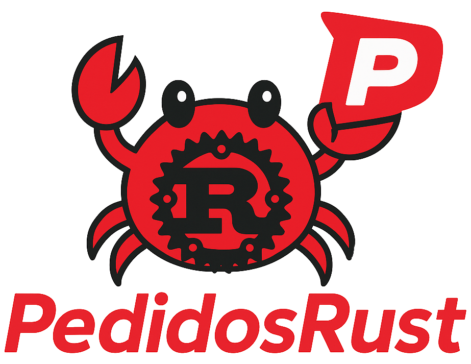

[](https://classroom.github.com/a/YmMajyCa)

Para información sobre setup del proyecto ver el documento [`./docs/contribute.md`](./docs/contribute.md).

---

# PedidosRust - Grupo MutexMasters

<p align="center">
    
</p>

PedidosRust es una nueva aplicación para conectar restaurantes, repartidores y comensales. Gracias a su innovadora implementación distribuida, permitirá reducir los costos y apuntar a ser líder en el mercado.

Los comensales podrán solicitar un pedido a un restaurante, los restaurantes notifican cuando el pedido está listo, y los repartidores buscan pedidos cercanos y los entregan.

### Integrantes

| Nombre               | Padrón | Email           |
| -------------------- | ------ | --------------- |
| Avalos, Victoria     | 108434 | -               |
| Chacón, Ignacio      |        | -               |
| Diem, Walter Gabriel | 105618 | wdiem@fi.uba.ar |
| Funes, Nicolas       |        | -               |

---

### Table of contents

1. [Aplicaciones](#Aplicaciones)
1. [Estructura del repositorio y sistema](#Estructura-del-repositorio-y-sistema)
1. [Uso](#Uso)

## Aplicaciones

Hay 5 aplicaciones ejecutables, las cuales son referenciados por sus nombres en inglés (por consistencia con la convención de programación):

- Requeridas por la consigna (4 apps): comensales (`customers`), restaurantes (`restaurants`), repartidores (`riders`), gateway de pagos (`payment`).

- Adicional (1 app): aplicación para simplificar el manejo de mensajes entre actores llamada `pedidos-rust`.

## Estructura del repositorio y sistema

El root del repositorio es un workspace que contiene los proyectos (ejecutables binarios separados, cada uno con su `Cargo.toml`) y el código en común:

```
.
├── common          Código compartido entre aplicaciones y protocolo
├── customer        Project del customer
├── docs
├── payment         Project del payment gateway
├── pedidos-rust    Project del pedidos-rust
├── restaurant      Project del restaurant
├── rider           Project del rider
└── Cargo.toml      Configuración del workspace
```

## Uso

Se deja las instrucciones para ejecutar las diversas apps:

**Customer:**

```bash
cargo run -p customer
```

**Payment:**

```bash
cargo run -p payment
```

**Pedidos-rust:**

```bash
cargo run -p pedidos-rust
```

**Restaurant:**

```bash
cargo run -p restaurant
```

**Rider:**

```bash
cargo run -p rider
```

---

## Diseño

### PedidosRust

### Customer

### Rider

### Restaurant

### Gateway
